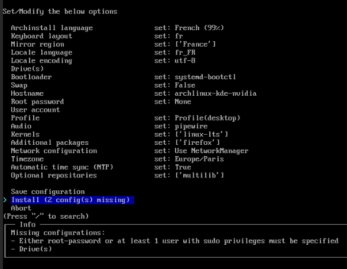

<h1 align="center">🐧 Archlinux</h1>
<h3 align="center">This repository contains multiple scripts to prepare my Archlinux systems.</h3>

  <a href="#-about">💡 About</a>&nbsp;&nbsp;&nbsp;|&nbsp;&nbsp;&nbsp;
  <a href="#-archinstall">🚀 Archinstall</a>&nbsp;&nbsp;&nbsp;|&nbsp;&nbsp;&nbsp;
  <a href="#%EF%B8%8F-post-install">🖥️ Post Install</a>&nbsp;&nbsp;&nbsp;|&nbsp;&nbsp;&nbsp;

---

  

---

## 💡 About

Multiple scripts to prepare my Archlinux systems.

##  🚀 Archinstall

Archinstall is a helper library which automates the installation of Arch Linux. It is packaged with different pre-configured installers, such as a "guided" installer.

  

- Boot to ISO Archlinux.
- Switch the keys to French Language : `loadkeys fr`
- If installation by wifi, type `iwctl` then `station wlan0 connect NAMEWIFI`, enter your password, then `quit` to quit iwctl. 
- Test the internet connection with `ping google.com`.
- Intel Configuration - Launch the command : `archinstall --config https://jturazzi.github.io/archlinux/kde-intel.json`
- Nvidia Configuration - Launch the command : `archinstall --config https://jturazzi.github.io/archlinux/kde-nvidia.json`
- Configure `storage` and create a `sudo user`.
- Launch install.
- Reboot.

##  🖥️ Post Install

- Launch the graphical environment in X11 instead of wayland.
- Run the scripts one by one.
- Reboot computer and switch graphical environment wayland.
- Done.